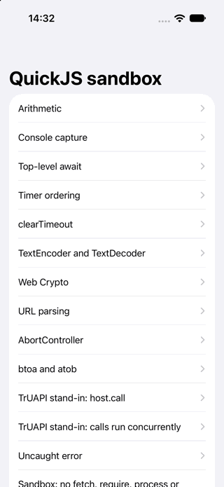
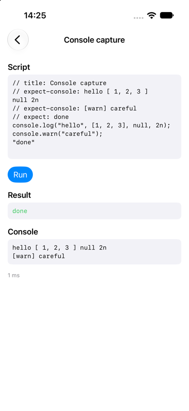
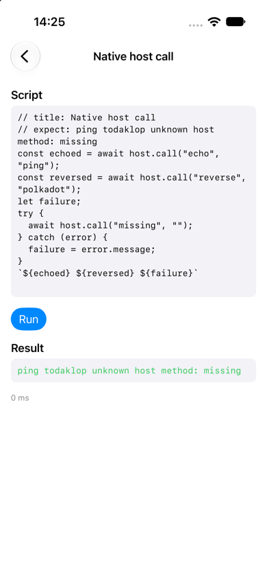
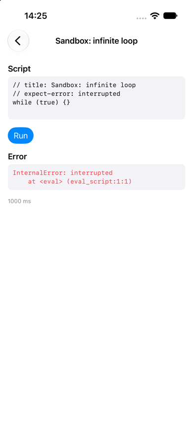

# rquickjs playground

Runs JavaScript in a QuickJS sandbox from Rust, with no WebView, and calls it from a SwiftUI app.
Built on [rquickjs](https://github.com/DelSkayn/rquickjs) (QuickJS-NG), a few
[LLRT](https://github.com/awslabs/llrt) modules for web globals, and
[UniFFI](https://github.com/mozilla/uniffi-rs) for the Swift bindings.

<p>
  
  
  
  
</p>

## Run

```bash
cargo test
```

```bash
scripts/build-ios.sh && open ios/Playground.xcodeproj
```

`cargo run --example run -- samples/07-crypto.js` runs one script from the command line. The iOS build
needs the `aarch64-apple-ios-sim` Rust target; rerun `scripts/build-ios.sh` after changing `src/`.

## What it does

- `run_script(source)` is the one exported function. It is async, runs the script on its own thread in
  a fresh QuickJS runtime, and returns the value or error plus everything the script logged.
- Limits per run: 16 MiB heap, 1 MiB stack, 1 second for execution and pending timers.
- Globals: `console`, timers, `queueMicrotask`, `crypto` (with `subtle`), `URL`, `TextEncoder`,
  `TextDecoder`, `atob`, `btoa`, `Buffer`, `AbortController`, `EventTarget`, and `host.call(method,
  payload)`, a native async function standing in for TrUAPI.
- No `fetch`, `require`, `process`, file system, network or `WebAssembly`.
- `samples/*.js` hold the scripts the app lists. Each header states what it must produce
  (`// expect:`, `// expect-error:`, `// expect-console:`), and `cargo test` checks every one.

## Findings

- `llrt_timers` keeps timers in process-wide state, and freeing a runtime with a timer pending aborts
  the process on a QuickJS leak assertion. `src/timers.rs` replaces it with timers owned by the runtime.
- `llrt_modules` 0.8.1-beta needs `rquickjs ^0.11` (current is 0.14), and its umbrella crate does not
  build without the `path` feature, so this depends on the individual `llrt_*` crates.
- rquickjs ships no iOS bindings. The iOS build enables its `bindgen` feature and passes clang the
  simulator target and SDK (`scripts/build-ios.sh`).
- A simulator debug build of the app is about 9 MB.
