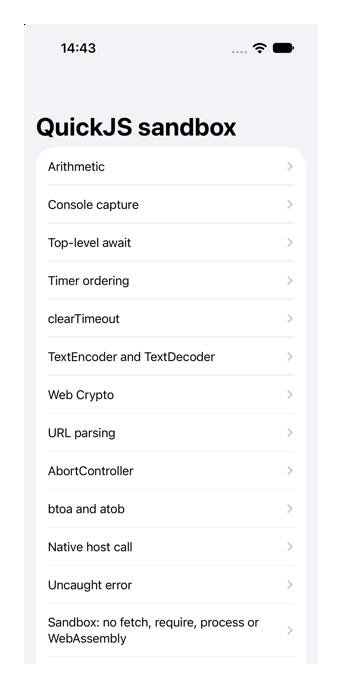
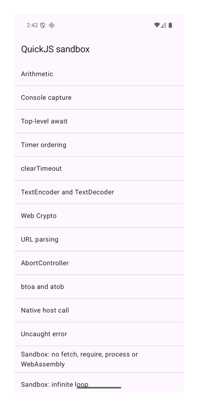

# rquickjs playground

Runs JavaScript in a QuickJS sandbox from Rust, with no WebView, and calls it from a SwiftUI app and a
Jetpack Compose app. Built on [rquickjs](https://github.com/DelSkayn/rquickjs) (QuickJS-NG), a few
[LLRT](https://github.com/awslabs/llrt) modules for web globals, and
[UniFFI](https://github.com/mozilla/uniffi-rs) for the Swift and Kotlin bindings.

| iOS simulator | Android emulator |
| :---: | :---: |
|  |  |

## Run

```bash
cargo test
```

```bash
scripts/build-ios.sh && open ios/Playground.xcodeproj
```

```bash
scripts/build-android.sh && (cd android && ./gradlew :app:installDebug)
```

`cargo run --example run -- samples/07-crypto.js` runs one script from the command line. Rerun the build
script for a platform after changing `src/`.

- iOS needs the `aarch64-apple-ios-sim` Rust target.
- Android needs the `aarch64-linux-android` Rust target, JDK 17, and the SDK in `ANDROID_HOME` with the
  NDK version pinned in `android/app/build.gradle.kts`. It builds for arm64 devices and emulators only.

## What it does

- `run_script(source)` is the one exported function. It is async, runs the script on its own thread in
  a fresh QuickJS runtime, and returns the value or error plus everything the script logged.
- Limits per run: 16 MiB heap, 1 MiB stack, 1 second for execution and pending timers.
- Globals: `console`, timers, `queueMicrotask`, `crypto` (with `subtle`), `URL`, `TextEncoder`,
  `TextDecoder`, `atob`, `btoa`, `Buffer`, `AbortController`, `EventTarget`, and `host`, a custom
  global injected from Rust whose `host.call(method, payload)` is a native async function.
- No `fetch`, `require`, `process`, file system, network or `WebAssembly`.
- Both apps also have a "Parallel sandboxes" screen: it starts N sandboxes at once (default 10), each
  waiting 200 ms before logging its own number, and lists them as they finish with the total time.
- `samples/*.js` hold the scripts both apps list. Each header states what it must produce
  (`// expect:`, `// expect-error:`, `// expect-console:`), and `cargo test` checks every one.

## Findings

- `llrt_timers` keeps timers in process-wide state, and freeing a runtime with a timer pending aborts
  the process on a QuickJS leak assertion. It is still that way on llrt `main`. `src/timers.rs`
  replaces it with timers owned by the runtime.
- The published `llrt_*` crates (0.8.1-beta) need `rquickjs ^0.11`, so this depends on llrt's `main`
  branch (0.9.0-beta, rquickjs 0.14), one crate per module. The 0.8.1-beta `llrt_modules` umbrella
  crate did not build without its `path` feature.
- rquickjs's `full` feature includes `dyn-load` (native modules through `dlopen2`), which does not
  compile for iOS or Android: `dlopen2` 0.9.0 uses `once_cell` there without depending on it. The
  sandbox enables only `futures`, and has no reason to load native modules anyway.
- rquickjs ships no iOS or Android bindings. Both builds enable its `bindgen` feature: iOS passes
  clang the simulator target and SDK, Android the NDK sysroot (see `scripts/`).
- Size: the iOS simulator debug app is about 12 MB, and the stripped Android arm64 library 6.4 MB.
